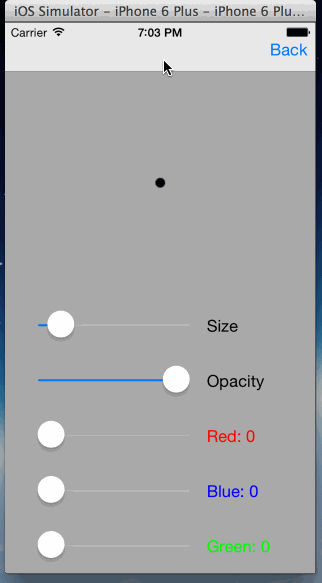

# iOS_Paintboard

Author: Shen Dong

# Intro

1. Save drawings to camera roll
2. Adjust brush sizes
3. Adjust brush colors
4. Preview selection
5. Reset

# TODO

1. Command patten for redo/undo
2. Collaborative editing
3. Load saved pictures
4. Add camera filters to edit pictures

# Reference

* [How To Make A Simple Drawing App with UIKit](http://www.raywenderlich.com/18840/how-to-make-a-simple-drawing-app-with-uikit)
